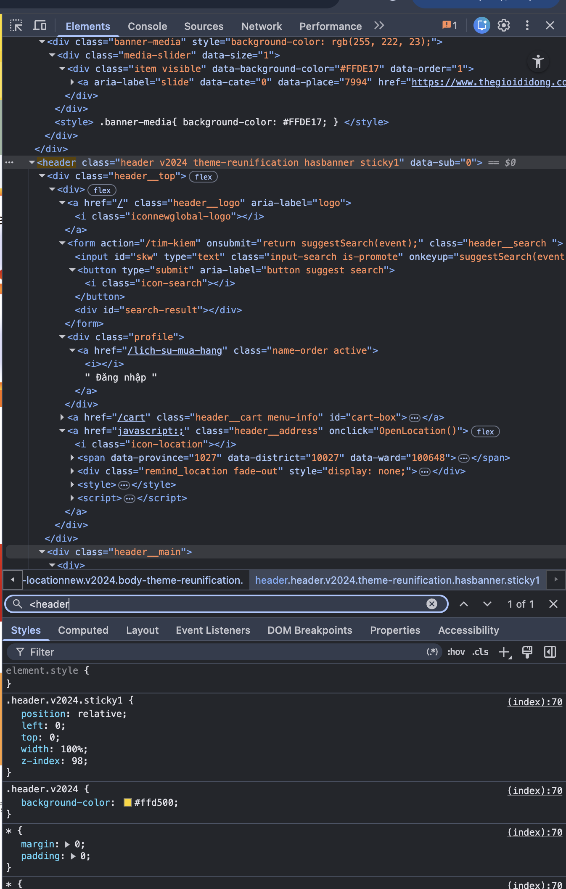
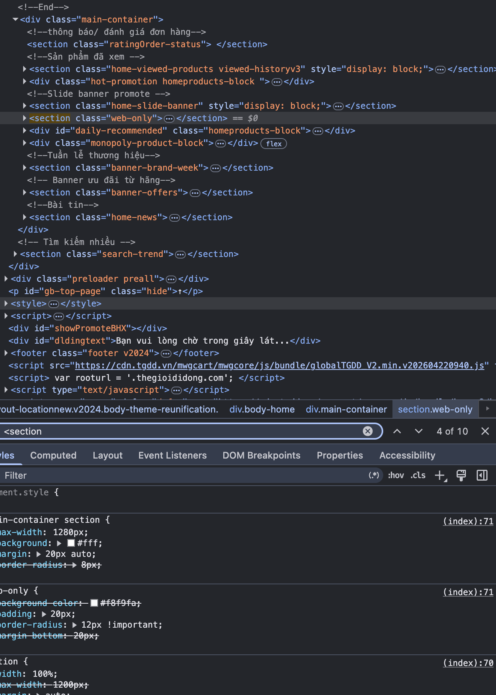
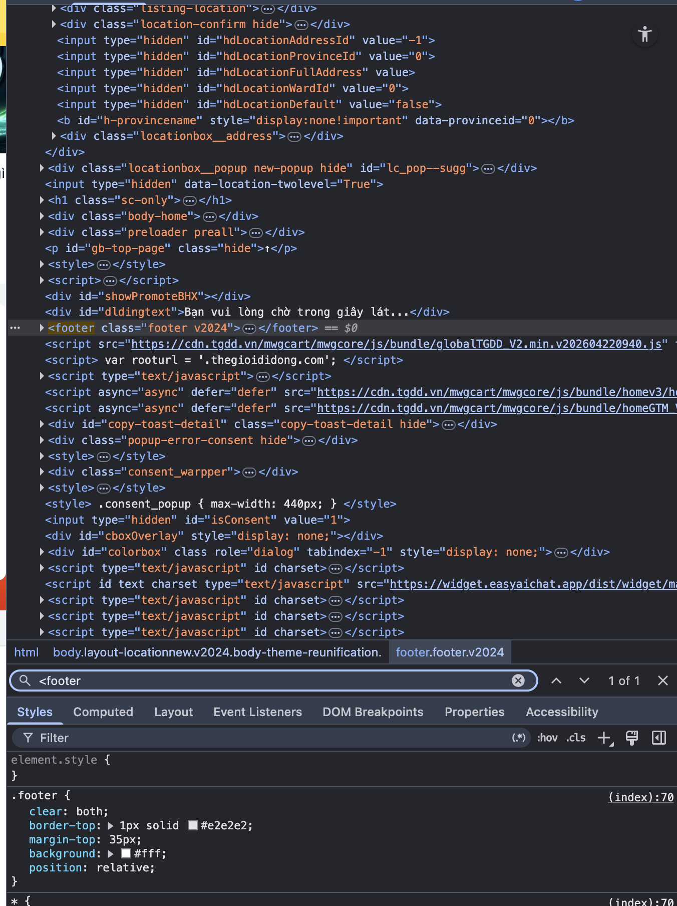
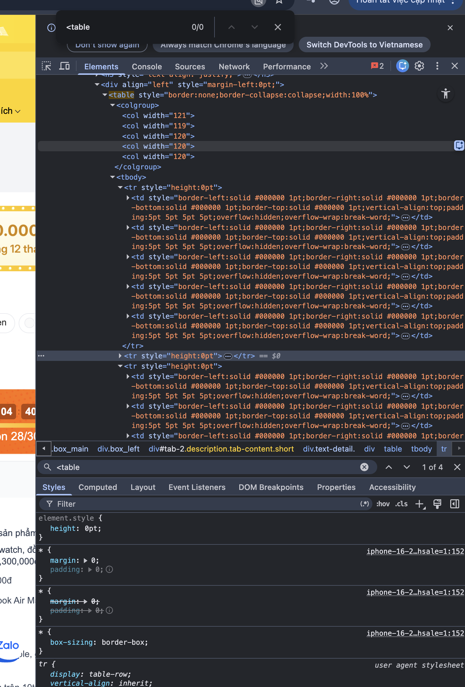
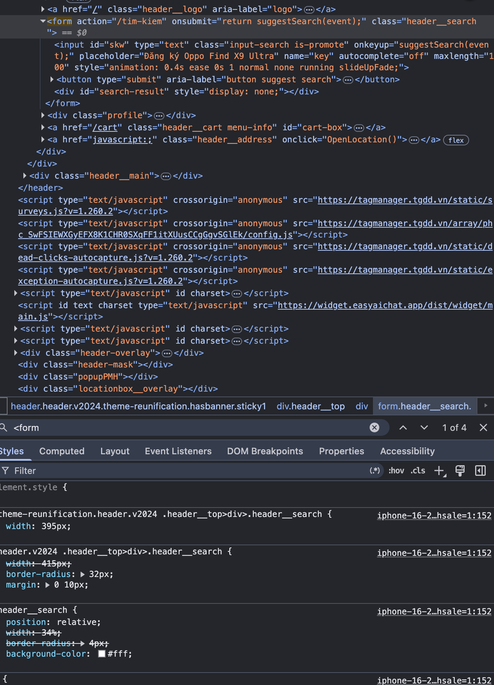

# Bài tập

## Phần A: Đọc hiểu

### Câu A1:

> Tài liệu tham chiếu: `01_introduction_html_universe.md`

- Khi gõ https://shopee.vn vào trình duyệt và nhấn Enter, thứ tự các bước là:
  - Bước 1: DNS lookup
  - Bước 2: TCP handshake
  - Bước 3: TLS handshake
  - Bước 4: HTTP request gửi đi
  - Bước 5: Sever trả về response
  - Bước 6: Parse HTML -> DOM/ CSSOM
  - Bước 7: Render

- Tab Network cho thấy thông tin của tất cả các HTTP request của trang  
  

#### Câu A2:

4 Lỗi cơ bản:  
 **Lỗi 1:** `<div class="header">`
**Fix:** dùng header  
 **Lỗi 2:** `<div class="logo">ShopTLU</div>`  
 **Fix:**: dùng `<h1>Shop TLU</h1>`  
 **Lỗi 3:** `<div class="menu">`  
 **Fix:**: dùng `<nav><ul><li><a>...</nav></ul></li></a>`  
 **Lỗi 3:** `<div class="main">`  
 **Fix:**: dùng `<main>`

#### Câu A3:

```txt
┌─────────────────────┐
│ Hộp 1               │ + <div> : block , full width
└─────────────────────┘
Text A, Text B          + <span></span>: cùng dòng
┌─────────────────────┐
│ Hộp 2               │ + <div> : block , xuống dòng mới
└─────────────────────┘
Text C Text D           + <span><strong> : cùng dòng, text D kiểu chữ Bold
┌─────────────────────┐
│ Hộp 3               │ + <div> : block , xuống dòng mới
└─────────────────────┘

```

Giải thích:

- div: thẻ block, luôn bắt đầu trên dòng mới, các phần tử khác không nằm trên cùng 1 dòng. Khi nó xuất hiện sau các thẻ inline thì nó vẫn tự động xuống dòng.
- span: là thẻ inline, chứa các text nằm trên cùng 1 dòng và không tạo ra line break.
- strong: là chữ in đậm.

#### Câu A4:

> Tài liệu tham chiếu: `tuan_1_html5/01_introduction_html_universe.md → 05_tables_hyperlinks.md`.  
> `<thead>:` Phần đầu bảng, là tiêu đề cột.  
> `<tbody>:` Phần thân bảng, là chứa dữ liệu của bảng.
> `<tfoot>:` Phần cuối bảng, là phần tổng kết.

- Không nên dùng table để tạo layout trang web vì:
  - Khả năng phản hồi kém: các bố cục trên bảng cứng nhắc, khó cập nhật.
  - Bảo trì kém: bảng cần nhiều phần tử lồng nhau làm cho file html cồng kềnh, khó cập nhật.
  - Giới hạn kiểu dáng: việc định dạng khó thực hiện hơn so với css.

## Phần B: Thực hành

### Câu B3:

- Lỗi 1: Dòng 1 - thiết html ở sau `<!DOCTYPE>` - Thêm html vào sau `<!DOCTYPE>` thành `<!DOCTYPE html>`.
- Lỗi 2: Dòng 4 - thẻ `<title>` chưa đóng - thêm `</title>` sau "Trang web".
- Lỗi 3: Dòng 8 - thẻ `<h1>` chưa đóng đúng cách - sửa `<h1>` sau chữ "ShopTLU" thành `</h1>`.
- Lỗi 4: Dòng 12 - thẻ `<a>` chưa đóng đúng cách - sửa `<a>` sau chữ "Trang chủ" thành `</a>`.
- Lỗi 5: Dòng 22 - thẻ `<b>` đóng sai thứ tự - đóng `</b>` ngay trước thẻ `</p>`.
- Lỗi 6: Dòng 20 - thiết alt - thêm alt vào sau src ảnh.
- Lỗi 7: Dòng 45 - Thẻ `<p>` chưa đóng trong `<footer>`- Thêm `</p>` vào sau "Copyright 2026".
- Lỗi 8: Dòng 40 - Sử dụng 2 thẻ `<main>` trong 1 trang - Sửa thẻ `<main>` thứ 2 thành thẻ `<aside>`.
- Lỗi 9: Dòng 5 - Sai charset - sửa thành `<meta charset="UTF-8">`.
- Lỗi 10: Chưa đóng thẻ `<html>` - Thêm `</html>` sau thẻ </body>.

### Câu B4:

1. 3 thẻ semantic HTML5 mà `thegioididong.com` sử dụng:

- thẻ `<header>`. 

- thẻ `<section>`. 

- thẻ `<footer>`. 

2. Ảnh
   
   `<table>` đó được sử dụng để trình bày dữ liệu dạng lưới cho việc mô tả sản phẩm  
   Có dùng tbody nhưng không dùng thead
3. 

- `action`: `"/tim-kiem"` có nghĩa là khi người dùng tìm kiếm, dữ liệu sẽ gửi đến đường dẫn `"/tim-kiem"` trên máy chủ để xử lí
- method: chưa thấy khai báo rõ ràng
- Input types được dùng: `type="text"`

## Phần C: Suy luận

### Câu C2:

Quan điểm "dùng `<div>` cho mọi thứ rồi thêm class là đủ" nghe có vẻ nhanh nhưng về kĩ thuật thì khá hạn chế. Đầu tiên là SEO, các công cụ tìm kiếm như Google sử dụng các thẻ sematic để hiểu cấu trúc và trọng tâm của trang web. Sử dụng đúng thẻ sẽ giúp bot xác định được đâu là nội dung chính, đâu là menu, đâu là bài viết. Thứ 2 là Accessibility, các công cụ hỗ trợ như trình đọc màn hình dựa vào các thẻ này để điều hướng người dùng khiếm thị. Nếu dùng hết là `<div>`, trình đọc màn hình sẽ coi toàn bộ trang là 1 khối văn bản phẳng, khiến người dùng không phân biệt được cấu trúc phân cấp thông tin. Ví dụ 1 trang tin tức dùng `<article>` cho mỗi bài viết. Screen render có thể liệt kê danh sách các bài và cho phép người dùng chọn nhanh bài cần đọc. Nếu dùng `<div>`, chức năng này gần như mất hoàn toàn. Tuy nhiên `<div>` vẫn có chỗ đứng. Nó phù hợp khi cần 1 container thuần để layout, ví dụ như 1 lớp wrapper cho grid hoặc các nhóm phần tử không mang ý nghĩa nội dung cụ thể.

## Phần D:

Link video:
https://drive.google.com/file/d/1dTd9PJgHsoC4pZVEwuO0loYnRxB1VfgW/view?usp=drive_link
