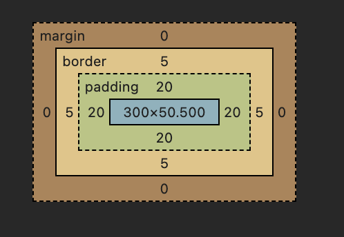
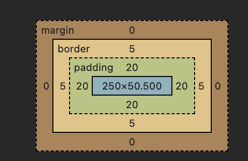
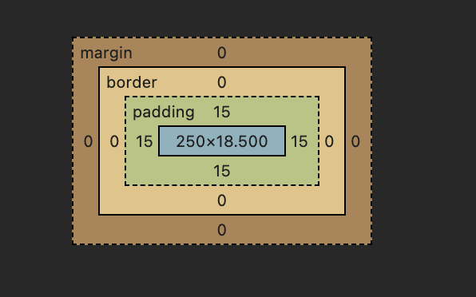
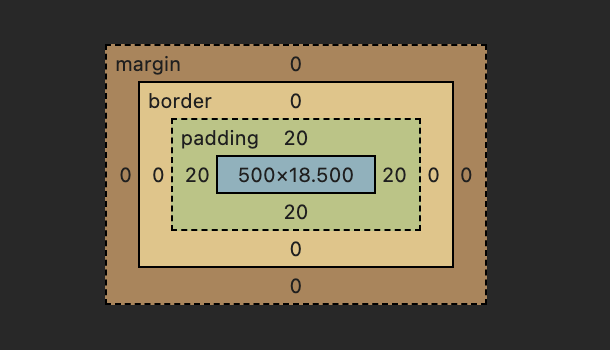
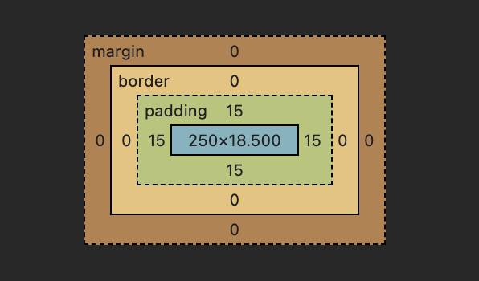
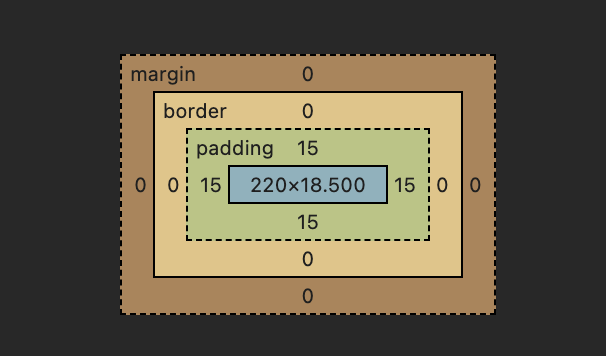
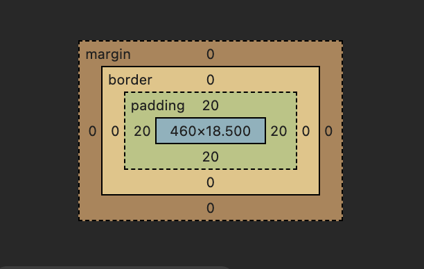
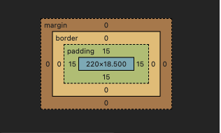
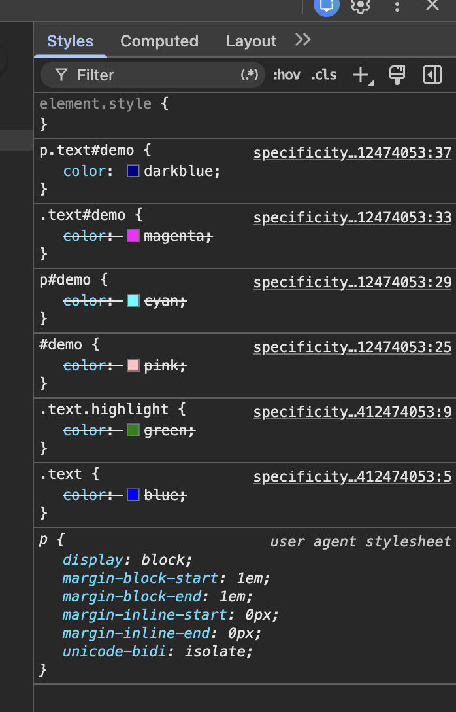

# Phần A:

## Câu A1:

3 cách nhúng CSS vào HTML:

- inline
  - Ví dụ: `html <h1 style="color: blue; font-size: 24px;">Nga ciu</h1>`
  - Ưu điểm:
    - Viết nhanh
    - CSS chỉ tác động đúng phần tử đó
    - Độ ưu tiên cao
  - Nhược điểm:
    - Code rối nếu nhiều style
    - Khó tái sử dụng
    - Khó bảo trì
    - Không hỗ trợ nhiều tính năng CSS mạnh
    - Không tách biệt giao diện và nội dung
  - Chỉ nên dùng khi test nhanh giao diện, email html, style nhỏ và chỉ dùng 1 lần
- internal
  - Ví dụ:
    ```html
    <head>
      <style>
        h1 {
          color: red;
          font-size: 24px;
        }
      </style>
    </head>
    ```
  - Ưu điểm:
    - Có thể dùng cho nhiều phần tử
    - Dễ quản lí cho inline
    - Hỗ trợ đầy đủ tính năng CSS
  - Nhược điểm:
    - CSS chỉ dùng được cho 1 trang
    - Khó bảo trì khi dự án lớn
    - HTML và CSS vẫn còn nằm chung
  - Nên sử dụng khi: website nhỏ, chỉ có 1 file HTML, học CSS cơ bản
- external
  - Ví dụ:

  ```html
  <head>
    <link rel="stylesheet" href="styles.css" />
  </head>
  ```

  - Ưu điểm:
    - Code sạch, chuyên nghiệp
    - Tái sử dụng tốt
    - Dễ bảo trì
    - Hỗ trợ đầy đủ tính năng CSS
    - website tải nhanh hơn
  - Nhược điểm:
    - Cần file CSS riêng
    - Nếu link sai thì mất CSS
  - Dùng cho dự án lớn, website thật, làm việc nhóm

Nếu cùng 1 element có cả 3 cách CSS đồng thời áp dụng thì inline thắng vì thứ tự ưu tiên của CSS là: Inline > Internal > External

## Câu A2:

1. `h1 `-> Chọn: ShopTLU
2. `.price `-> Chọn 25.990.000đ, 45.990.000đ
3. `#app header` -> Chọn ShopTLU, Home, Products, About
4. `nav a:first-child ` -> Chọn Home
5. `.product.featured h2` -> Chọn MacBook Pro
6. `article > p` -> Chọn 25.990.000đ, Mô tả sản phẩm..., 45.990.000đ, Mô tả sản phẩm...
7. `a[href="/"]` -> Chọn Home
8. `.top-bar.dark h1` -> Chọn ShopTLU

## Câu A3:

- Trường hợp 1:
  - Chiều rộng hiển thị = 450
  - Không gian chiếm trên trang = 470
- Trường hợp 2:
  - Chiều rộng hiển thị = 400
  - Kích thước content thực tế = 350
  - Không gian chiếm trên trang = 420
- Trường hợp 3:
  - Khoảng cách giữa box-a và box-b = 40
  - Không phải là 65px vì CSS lấy giá trị lớn hơn
- Nếu .box-a có margin-bottom: -10px và .box-b có margin-top: 40px, khoảng cách = 40 + (-10) = 30px

## Câu A4:

1.

- Rule A:
  - ID: 0
  - Class: 0
  - tag `p`: 1
- Rule B:
  - ID: 0
  - Class `.price`: 1
  - tag: 0
- Rule C:
  - ID `#main-price`: 1
  - Class: 0
  - tag: 0
- Rule D:
  - ID: 0
  - Class `.price`: 1
  - tag `p`: 1

2.

- Element sẽ có màu đỏ
- Vì CSS ưu tiên ID > class > tag mà `#main-price { color: red; }` mạnh nhất

3. Nếu thêm `<p class="price" id="main-price" style="color: orange;">` thì element sẽ có màu cam.
4. Nếu Rule A thêm !important, element có màu đen. Vì khi một thuộc tính được gán !important, nó sẽ phá vỡ mọi quy tắc tính điểm specificity thông thường và chiếm quyền ưu tiên cao nhất (cao hơn cả Inline style và ID selector).

# Phần B:

## Câu B1:

- Các selectors được dùng: \*, body, header, nav, nav ul, nav a, nav a:hover, .active, table, th,td, tr:nth-child(even), tr:hover, footer, figure,
  figure img, figcation, #about, #skill, #contact
- Các loại selectors đã dùng:
  - Universal selector
  - Element selector
  - Class selector
  - ID selector
  - Descendant selector
  - Pseudo-class selector
  - Group selector

## Câu B2:

### Phần 1:

Hộp 1 (content-box): chiều rộng thực tế = 350 px



Hộp 2 (border-box): chiều rộng thực tế = 300 px



- `box-sizing: content-box` làm padding và border cộng thêm vào kích thước thật của phần tử
- `box-sizing: border-box` thu hẹp phần content bên trong nên kích thước vẫn được giữ nguyên

### Phần 2:

- Nếu không dùng `border-box` thì tổng sẽ bằng 1100
  - sidebar: 280

  
  - content: 540

  
  - ads: 280

  

- Nếu thêm `border-box` thì tổng sẽ đúng bằng 1000
  - sidebar: 220

  
  - content: 460

  
  - ads: 220

  

## Câu B3:

- 10 rules:
  - p: (0, 0, 1)
  - .text: (0, 1, 0)
  - .text.highlight: (0, 1, 1)
  - .p.text: (0, 1, 1)
  - .p.text.highlight: (0, 2, 0)
  - div.text: (0, 2, 1)
  - #demo: (1, 0, 0)
  - p#demo: (1, 0, 1)
  - .text#demo: (1, 1, 0)
  - p.text#demo: (1, 1, 1)

- Element cuối cùng hiển thị màu darkblue vì rule p.text#demo có specificity score cao nhất (1, 1, 1) nên nó ghi đè các rule khác



- Nếu thay đổi thứ tự rules trong CSS file thì kết quả không đổi vì:
  - Nếu specificity KHÁC nhau thì thứ tự không quan trọng, rule có specificity score cao hơn thắng
  - Nếu specificity bằng nhau thì rule viết sau sẽ thắng.

# Phần C:

## Câu C1:

1.

- Chiều rộng thực tế của sidebar = 342px
- Chiều rộng thực tế của content = 722px

2. Layout bị vỡ là do tổng chiểu rộng của 2 khối là 1064 > container bằng 960px, `content` không còn đủ chỗ trống nên trình duyệt tự động đẩy nó xuống dòng mới

3. 2 cách sửa:

- Cách 1: dùng border-box
  - sidebar: width 300px gồm padding và border
  - content: width 660px gồm padding và border

- Cách 2: Tính toán lại width
  - sidebar width mới: $300 - (20 \times 2) - (1 \times 2) =$ 258px
  - content width mới: $660 - (30 \times 2) - (1 \times 2) =$ 598px
    -> tổng = 960px

## Câu C2:

1. Sản phẩm A có

- `font-size` = 20px. Mặc dù nằm trong `.container` (14px), nhưng h2 có class `.title` nằm trong `.card`. `.card .title` trỏ trực tiếp và có độ ưu tiên cao hơn giá trị kế thừa từ cha.
- `color` = green. Vì có từ khóa `!important`, quy tắc `.highlight` sẽ chiến thắng mọi cấp độ Specificity khác

2. "Mô tả sản phẩm" (p trong card featured) có `color` = blue.

- Thẻ `p` này có quy tắc `.card p { color: inherit; }`. Thuộc tính `inherit` bắt buộc phần tử phải lấy giá trị màu từ phần tử cha trực tiếp của nó là `.card`.

3. "Sản phẩm B" (h2) có

- `font-size` = 20px. Quy tắc `.card .title` thiết lập kích thước chữ 20px cho mọi phần tử `.title` nằm bên trong `.card`.
- `color` = blue. Rule `#featured .title` không còn hiệu lực vì thẻ này nằm ngoài id `featured`. Chỉ còn rule `.card .title`

4. "Mô tả sản phẩm B" (p.highlight) có `color` = green. Dù nó là thẻ `p` đang có rule `inherit` từ `.card` màu xanh, nhưng sự xuất hiện của class `.highlight` đi kèm `!important `đã phá vỡ mọi quy tắc kế thừa và gán màu xanh lá cây cho nó.

# Phần D:

Link video: https://drive.google.com/file/d/1GRyVBSHTVV2pGQj1Eodd_YL2_L0pBzse/view?usp=sharing
