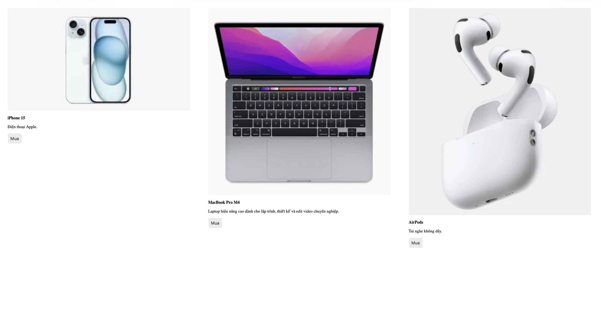
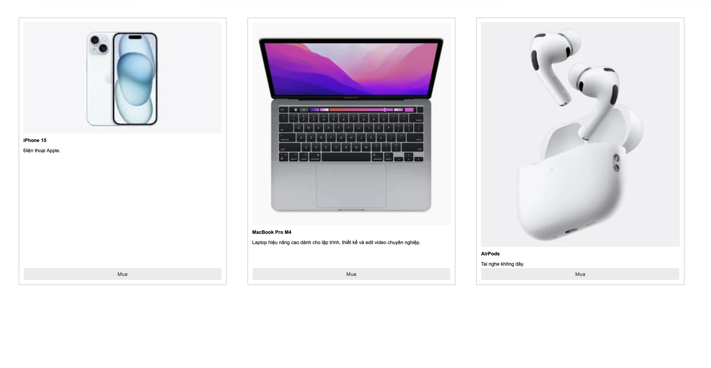
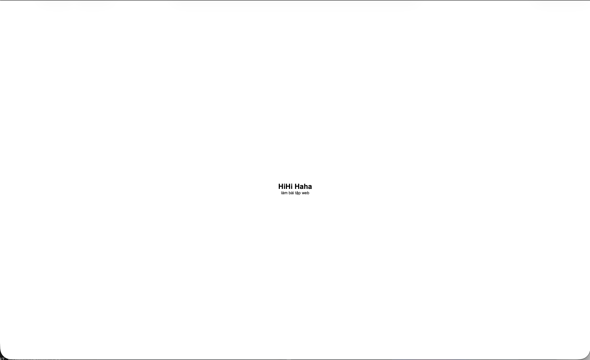
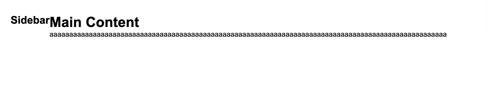
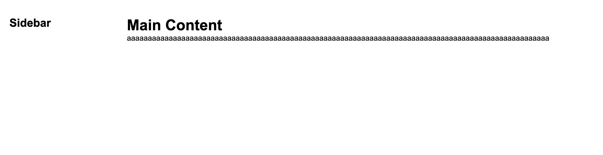

# Phần A:

## Câu A1:

| Position   | Vẫn chiếm chỗ trong flow? | Tham chiếu vị trí       | Cuộn theo trang? | Use case                                    |
| ---------- | ------------------------- | ----------------------- | ---------------- | ------------------------------------------- |
| `static`   | ✅                        | Không dùng              | ✅               | Mặc định — không cần viết                   |
| `relative` | ✅                        | Vị trí gốc của nó       | ✅               | Làm anchor cho absolute con, dịch nhẹ       |
| `absolute` | ❌                        | Cha `relative` gần nhất | ✅               | Badge, dropdown, tooltip, overlay           |
| `fixed`    | ❌                        | Viewport                | ✅               | Chat button, cookie banner, header cố định  |
| `sticky`   | ✅→❌                     | Viewport (khi dính)     | ✅, ❌           | Sticky header, sticky table header, sidebar |

- `absolute` tham chiếu `body` khi không tìm thấy parent nào có `relative`, `absolute`, `fixed`, `sticky`.
- `absolute` tham chiếu parent khi parent gần nhất có position khác static
- "nearest positioned ancestor" là thằng cha gần nhất có position khác static để làm mốc toạ độ cho element con. Khi 1 element dùng `position: absolute` thì nó sẽ đi tìm từ element đó lên các thằng cha phía trên. Nếu thằng cha gần nhất có position khác static thì nó lấy cha đấy làm mốc. Nếu tất cả cha đều là `static` thì nó sẽ bám theo toàn trang.

## Câu A2:

- Trường hợp 1: 4 items
  - Chia đều 1 cột, 4 hàng bằng nhau
  - ```text
     +----+----+----+----+
     | 1  | 2  | 3  | 4  |
     +----+----+----+----+
    ```
- Trường hợp 2: 6 items
  - Bố cục: 3 hàng, 2 cột
  - ```text
      +------+------+
      |  1   |  2   |
      +------+------+

      +------+------+
      |  3   |  4   |
      +------+------+

      +------+------+
      |  5   |  6   |
      +------+------+
    ```

- Trường hợp 3: 3 items
  - Bố cục: item đầu sát trái, item cuối sát phải, item nằm giữa với khoảng cách đều
  - ```text
      +-----------------------------------+
      |                                   |
      | 1              2               3  |
      |                                   |
      +-----------------------------------+
    ```
- Trường hợp 4: 3 items
  - Bố cục: 3 cột, cột 1 và 3 chiếm 200px, cột 2 chiếm 1fr
  - ```text
      +--------+------------------+--------+
      |   1    |        2         |   3    |
      | 200px  |       1fr        | 200px  |
      +--------+------------------+--------+
    ```
- Trường hợp 5: 7 items
  - Bố cục: 3 cột bằng nhau, item cuối nằm ở hàng 3 cột 1
  - ```text
      +----+----+----+
      | 1  | 2  | 3  |
      +----+----+----+

      +----+----+----+
      | 4  | 5  | 6  |
      +----+----+----+

      +----+----+----+
      | 7  |    |    |
      +----+----+----+
    ```

# Phần C:

## Câu C1:

1. Dùng flexbox vì navbar là layout 1 chiều theo hàng ngang, flexbox rất hợp để căn trái/phải, canh giữa, spacing giữa các item

2. Dùng grid vì đây là layout 2 chiều (hàng + cột). Grid giúp chia cột đều nhau rất dễ bằng `grid-template-columns`

3. Kết hợp cả 2 vì thường dùng Grid để chia bố cục lớn (content + sidebar), bên trong từng phần dùng flexbox để căn chỉnh các item nhỏ.

4. Dùng grid vì footer dạng nhiều cột đều nhau nên Grid gọn và rõ ràng hơn.

5. Dùng flexbox vì card là layout dọc 1 chiều

## Câu C2:

- Lỗi 1: Cards không đều chiều cao — nút "Mua" bị nhảy lên/xuống
  - Các `.card` có lượng text khác nhau nên chiều cao mỗi card khác nhau.
  - Nút .btn nằm ngay sau nội dung nên card nào text ngắn → nút bị nhảy lên cao.

  - Trước khi sửa:
    
  - Sau khi sửa:  
     

- Lỗi 2: Muốn items nằm giữa cả ngang lẫn dọc trong container 100vh, nhưng item vẫn dính góc trái trên
  - Container `.hero` có `display: flex` nhưng chưa có: `justify-content`, `align-items`
  - Mặc định của flexbox là ngang -> `flex-start`, dọc -> `stretch`

  - Trước khi sửa:  
    
  - Sau khi sửa:  
    

- Lỗi 3: Sidebar bị co lại khi content quá dài
  - Trong flexbox, các item mặc định có `flex-shrink: 1 `. Khi content quá dài, flexbox ép sidebar nhỏ lại để đủ chỗ
  - Trước khi sửa:  
    
  - Sau khi sửa:  
    
